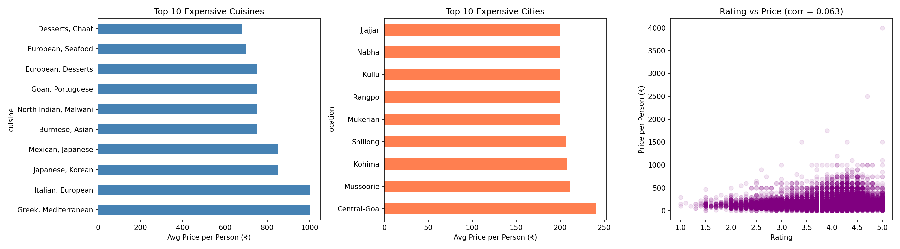

# swiggy_price_analysis
# 🍽️ Swiggy Restaurant Price Analysis

A data cleaning and exploratory analysis project on 1.4 lakh Swiggy restaurants across 581 Indian cities.

---

## 📌 Key Findings

- **Greek and Italian cuisines** are the most expensive on Swiggy, averaging ₹1000/person
- **Central-Goa** leads city-wise pricing at ₹240/person — tourist premium effect
- **Rating and price have near-zero correlation (0.063)** — a higher-rated restaurant does NOT mean a more expensive one

---

## 📊 Visualizations



---

## 🛠️ Skills Used

- Python, Pandas
- Data cleaning — string extraction, null handling, type conversion
- Exploratory Data Analysis (EDA)
- Matplotlib — bar charts, scatter plot

---

## 🧹 Cleaning Steps

| Column | Problem | Fix |
|---|---|---|
| `Average Price` | String format `"₹250 for two"` | Extracted number, divided by 2 |
| `Rating` | Had `"NEW"` mixed with floats | Replaced with NaN, converted to float |
| `Number of Ratings` | `"5K+ ratings"`, `"Too Few Ratings"` | Extracted numeric value |
| `Cuisine`, `Area` | 27 missing values | Dropped null rows |

---

## 📁 Dataset

- Source: [Swiggy India Dataset — Kaggle](https://www.kaggle.com)
- Rows: 1,40,628
- Cities: 581
- Columns: 10

---

## 🚀 How to Run

```bash
pip install pandas matplotlib
python swiggy_analysis.py
```

---

## 📂 Project Structure

```
swiggy-price-analysis/
│
├── swiggy_analysis.py      # Main script
├── swiggy_analysis.png     # Output chart
└── README.md
```

---

*Part of my Data Analyst learning roadmap — Phase 2: Data Cleaning with Python*
